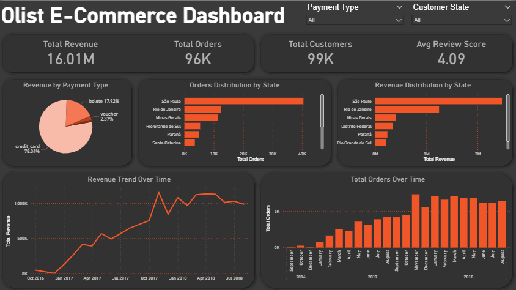

# Olist E-Commerce Dashboard

## Introduction

This project presents an interactive Power BI dashboard built on the Olist Brazilian E-Commerce dataset. The dashboard provides a comprehensive view of business performance — covering revenue trends, customer distribution, order volumes, payment behavior, and review scores — through clean, filterable visualizations designed for fast decision-making.

## Background
Olist is a Brazilian e-commerce platform that connects small businesses to major marketplaces. The publicly available dataset on Kaggle contains 100,000+ orders placed between 2016 and 2018, spanning nine relational tables including orders, customers, products, sellers, payments, and reviews.
The goal of this project was to transform that raw relational data into a single-page executive dashboard that answers key business questions:

- How is revenue trending over time?
- Which states and payment types drive the most sales?
- How are total orders trending over time?
- Where are orders concentrated geographically?

## Skills Showcased

This project put key Power BI features into practice. Here's what we mastered:

- **Dashboard Design:** Crafting an intuitive and visually appealing report layout.
- **Power Query ETL:** Performing data cleaning, shaping, and transformation.
- **Data Modeling:** Building efficient data models with relationships (Star Schema principles).
- **DAX Fundamentals:** Creating calculations and aggregations to derive key insights.
- **Visualizations Utilized:**
    - **Core Charts:** Column, Bar, Line, and Pie charts for comparisons and trends.
    - **Cards:** To highlight key performance indicators.
    - **Chart Variety:** Selecting from common and uncommon chart types for effective storytelling.
- **Interactive Features:**
    - **Slicers:** Enabling dynamic, user-driven data filtering.

## Dashboard Overview

  

## Insights

- São Paulo state dominates both orders and revenue, accounting for the largest share by a significant margin
- Credit card is the most preferred payment method at 78.34%, followed by boleto (17.92%) and voucher (2.37%).
- Revenue peaked around November 2017 – January 2018, then stabilized at a high level through mid-2018.
- Order volume grew consistently from late 2016 through mid-2018, indicating strong platform growth across the entire observation period.
- Average review score of 4.09 out of 5 suggests generally high customer satisfaction.
- Revenue distribution by state closely mirrors order distribution, meaning average order value is relatively consistent across regions rather than being driven by a few high-value states.

## Conclusion

This dashboard demonstrates how a multi-table e-commerce dataset can be transformed into an actionable, executive-ready report using Power BI. The combination of KPI cards, trend lines, geographic breakdowns, and interactive slicers allows stakeholders to quickly identify where revenue is coming from, how the business has grown, and where to focus attention.
Future extensions of this project could include:

- Delivery performance analysis — on-time vs. late deliveries by state or seller
- Seller performance dashboard — a separate page ranking sellers by revenue and review score
- Customer segmentation — RFM (Recency, Frequency, Monetary) analysis

*Dataset Source: [Olist Brazilian E-Commerce Dataset — Kaggle](https://www.kaggle.com/datasets/olistbr/brazilian-ecommerce)*